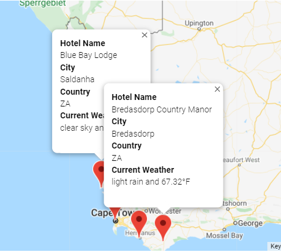

# World_Weather_Analysis

## I. Overview of Project

### Background
People loves the PlanMyTrip app, but to improve the new product, they’ve recommended a few changes to take the app to the next level.

### Objective
For Beta Testing, the  tester will choose four cities to create a travel itinerary from the list of potential travel destinations. Using the Google Maps Directions API, we will create a travel route between the four cities as well as a marker layer map.

## II. Results

The city data:

The WeatherPy Vacation Map:

The WeatherPy Travel Map:

The WeatherPy Travel Map Markers:

